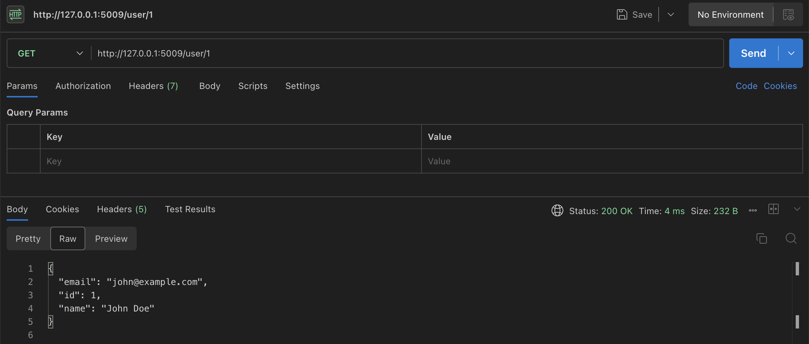
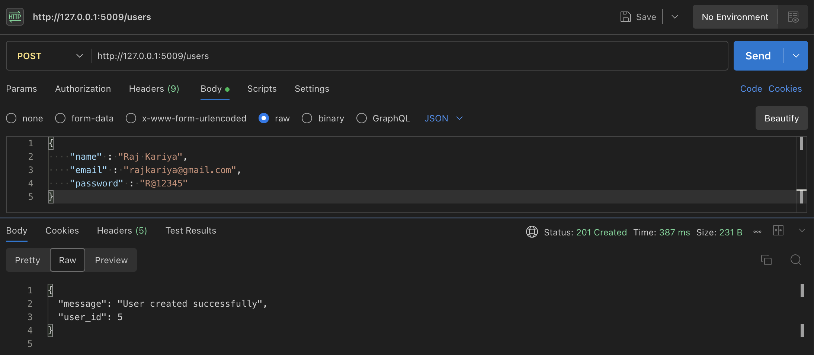

# Changes Made to the Codebase

## Major Issues Identified

1. **Security Vulnerabilities**
   - SQL Injection vulnerabilities in all database queries
   - Passwords stored and compared in plaintext
   - No input validation
   - No proper session management

2. **Code Organization**
   - No separation of concerns
   - All code in a single file
   - No proper error handling
   - No code reusability

3. **API Design**
   - Inconsistent response formats
   - No proper HTTP status codes
   - No proper error messages
   - No proper validation of request data

## Changes Made

1. **Security Improvements**
   - Implemented parameterized queries to prevent SQL injection
   - Added proper password hashing and comparison
   - Added input validation using marshmallow schemas
   - Added proper error handling with try-catch blocks

2. **Code Organization**
   - Separated database operations into a separate module
   - Added proper configuration management
   - Implemented proper response formatting
   - Added proper error handling middleware

3. **Best Practices**
   - Added proper HTTP status codes
   - Implemented consistent JSON responses
   - Added input validation
   - Improved error messages

4. **Documentation**
   - Added inline documentation
   - Updated API documentation
   - Added code comments for complex operations

## Trade-offs and Future Improvements

1. **What could be improved with more time:**
   - Add proper authentication middleware
   - Implement JWT for session management
   - Add rate limiting
   - Add request logging
   - Add more comprehensive input validation
   - Add unit tests
   - Add database migrations
   - Add API versioning

2. **AI Tools Used:**
   - GitHub Copilot was used for code suggestions and documentation
   - Changes were reviewed and modified manually to ensure security and best practices

# API Documentation and Screenshots

Here are examples of all API endpoints in action:

1. **Health Check** (`GET /`)
   

2. **Get All Users** (`GET /users`)
   

3. **Get User by ID** (`GET /user/{id}`)
   

4. **Create User** (`POST /users`)
   

5. **Update User** (`PUT /user/{id}`)
   

6. **Delete User** (`DELETE /user/{id}`)
   

7. **Search Users** (`GET /search?name={name}`)
   

8. **User Login** (`POST /login`)
   
